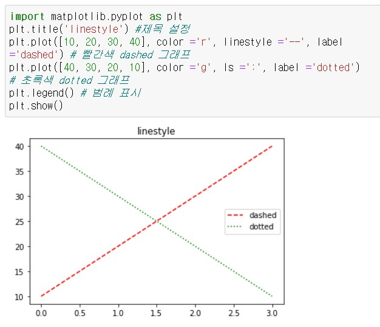
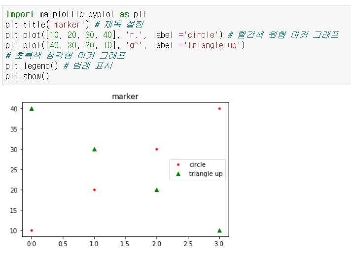
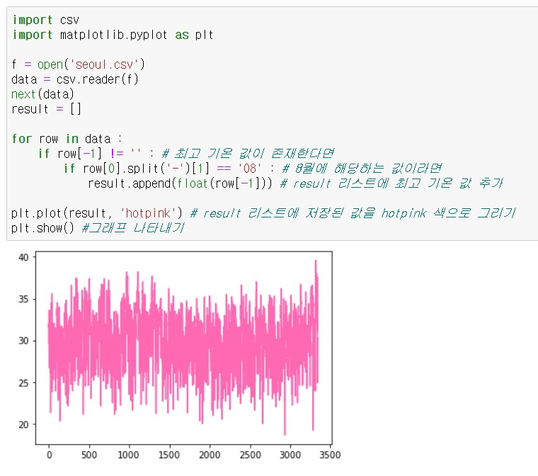
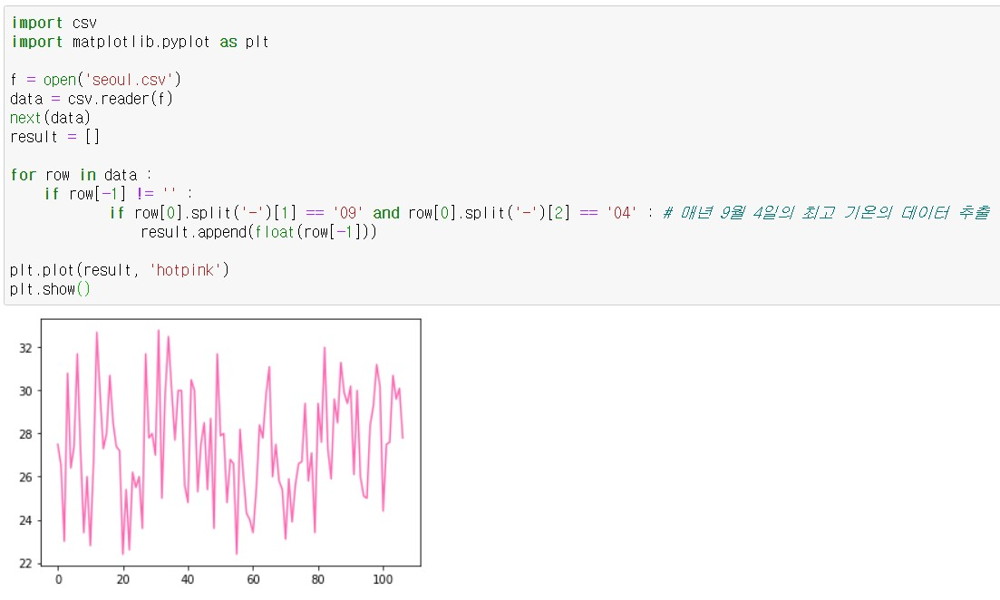
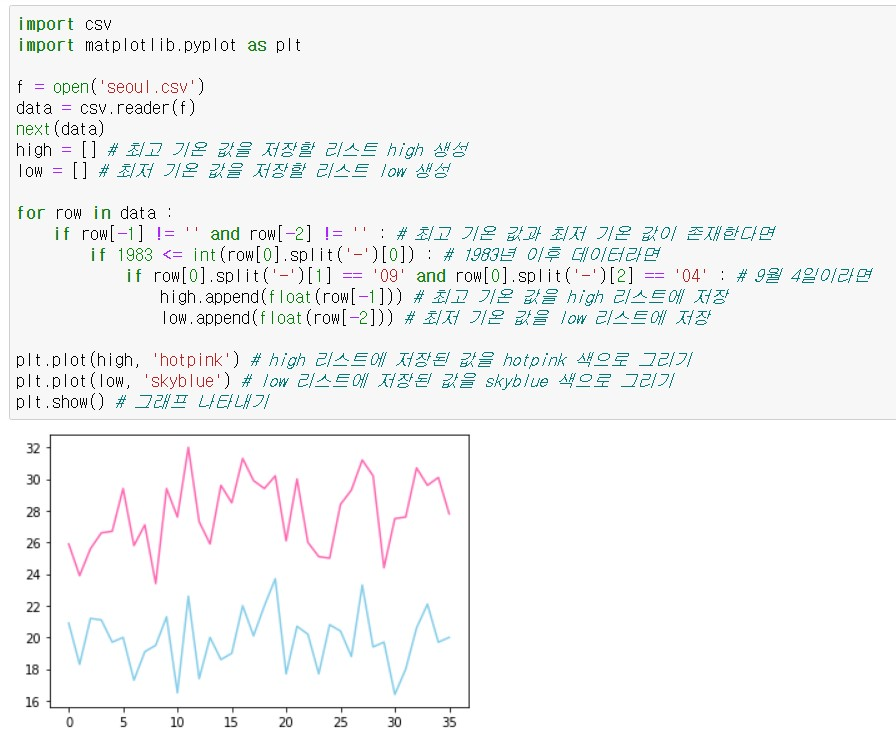
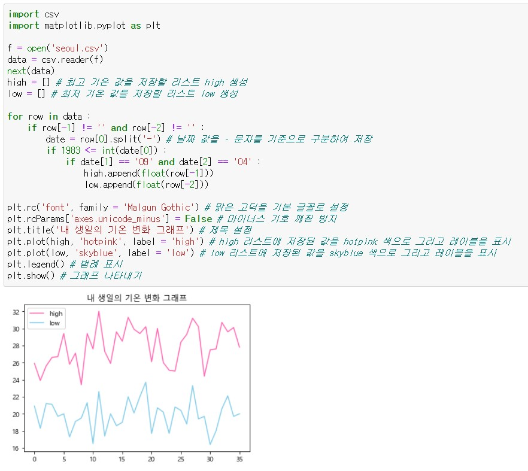
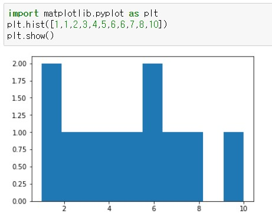
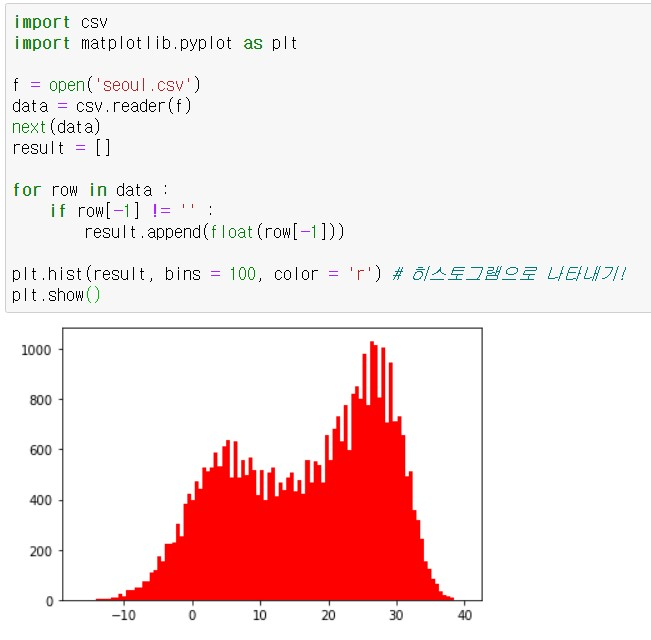
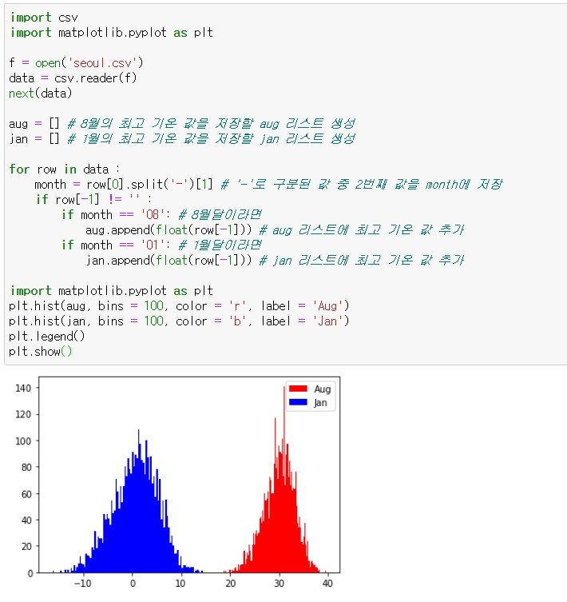
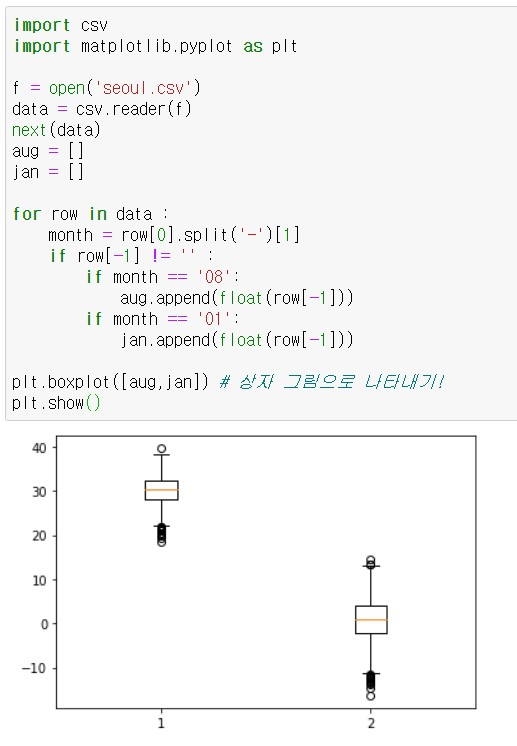

둘째마당 데이터 시각화 기초 목차
========

[UNIT 04 기본 그래프 그리기](#unit-4-기본-그래프-그리기)
---------
1. '[matplotlib](https://matplotlib.org, "matplotlib 홈페이지") 라이브러리'란?
2. 기본 그래프 추가하기
3. 그래프에 옵션 추가하기

[UNIT 05 내 생일의 기온 변화를 그래프로 그리기](#unit-5-내-생일의-기온-변화를-그래프로-그리기)
---------
1. 데이터에 질문하기
2. 데이터 시각화하기
3. 날짜 데이터 추출하기

[UNIT 06 기온 데이터를 다양하게 시각화하기](#unit-6-기온-데이터를-다양하게-시각화하기)
---------
1. 데이터에 질문하기
2. 히스토그램
3. 기온 데이터를 히스토그램으로 표현하기
4. 기온 데이터를 상자 그림으로 표현하기

----------------------------------------------

## UNIT 4 기본 그래프 그리기

### 1. 'matplotlib 라이브러리'란?
> matplotlib 라이브러리는 파이썬에서 2D 형태의 그래프, 이미지 등을 그릴 때 사용하는 것으로, 실제 과학 컴퓨팅 연구 분야나 인공지능 연구 분야에서 많이 활용됨

* [matplotlib 홈페이지](https://matplotlib.org, "matplotlib 홈페이지")

matplotlib 라이브러리 중 pyplot 모듈 불러오기

```python
import matplotlib.pyplot
```

이름이 너무 길고 복잡하므로 앞으로 라이브러리를 임포트할 때는 *plt* 라는 별명 사용
```python
import matplotlib.pyplot as plt
```

### 2. 기본 그래프 그리기

> *plot()* 함수는 직선 또는 꺾은선 형태의 그래프를 그릴 때 사용

기본 그래프 그리는 보통의 세 단계
1. import matplotlib.pyplot as plt : 라이브러리 불러오기
2. plt.plot([x축 데이터], [y축 데이터]) : plot() 함수에 데이터 입력하기
3. plt.show() : 그래프 보여주기


### 3. 그래프에 옵션 추가하기

* 그래프에 제목 넣기
> *title()* 함수는 제목을 넣는 함수

```python
plt.title('제목에 넣을 문자열')
```

* 그래프에 범례 넣기
> plot() 함수에 label이라는 속성의 레이블 값으로 원하는 문자열을 넣어주고, 그래프를 그리기 전에 legend() ~~전설 아닙니다~~ 함수 실행시키면 레이블 값이 범례로 나타남
 
```python
plt.plot([x축 데이터], [y축 데이터], label='레이블 값')
plt.legend()
```


* 그래프 색상 바꾸기
> color 속성 추가
>> r == red, g == green, b == blue, k == black, y == yellow 등등

```python
plt.plot(~~~, color='원하는 색상')
```


* 그래프 선 모양 바꾸기
> plot() 함수는 기본적으로 직선으로 그래프를 그리지만 linestyle 속성에 원하는 선 모양 지정 가능

```python
plt.plot(~~~, linestyle='-- or :')
```



* 마커 모양 바꾸기

```python
# 빨간색 원형 마커 그래프
plt.plot([데이터], 'r.')

# 초록색 삼각형 마커 그래프
plt.plot([데이터], 'g^')
```



----------------------------------------------

## UNIT 5 내 생일의 기온 변화를 그래프로 그리기

### 1. 데이터에 질문하기

* 데이터 읽어오기

```python
import csv

f = open('seoul.csv')
data = csv.reader(f)

for row in data :
    print(row)
```


> next() 함수를 사용해 데이터의 맨 윗줄에 있는 헤더 부분을 제외시킨 후, 최고 기온 데이터만 출력

```python
import csv

f = open('seoul.csv')
data = csv.reader(f)
next(data)

for row in data :
    print(row[-1])
```


* 데이터 리스트에 저장하기

```python
import csv
f = open('seoul.csv')
data = csv.reader(f)
next(data)
result = [] # 최고 기온 데이터를 저장할 리스트 생성

for row in data :
    if row[-1] != '' : # 최고 기온 데이터 값이 존재한다면
        result.append(float(row[-1])) # result 리스트에 최고 기온 값 추가
print(result)
```

### 2. 데이터 시각화하기

### 3. 날짜 데이터 추출하기

> split() 문자열 함수는 사용자가 설정하는 특정 문자를 기준으로 문자열을 분리

8월 데이터만 나타내기

```python
import csv
import matplotlib.pyplot as plt

f = open('seoul.csv')
data = csv.reader(f)
next(data)
result = []

for row in data :
    if row[-1] != '' : # 최고 기온 값이 존재한다면
        if row[0].split('-')[1] == '08' : # 8월에 해당하는 값이라면
            result.append(float(row[-1])) # result 리스트에 최고 기온 값 추가

plt.plot(result, 'hotpink') # result 리스트에 저장된 값을 hotpink 색으로 그리기
plt.show() #그래프 나타내기
```



이제는 매년 돌아오는 생일을 기준으로 설정

```python
for row in data :
    if row[-1] != '' :
            if row[0].split('-')[1] == '09' and row[0].split('-')[2] == '04' : # 매년 9월 4일의 최고 기온의 데이터 추출
                result.append(float(row[-1]))
```



~~9월 4일 내 생일~~

조금 더 자세히 살펴보기 위해 1983년 이후 데이터만 추출  
또한, 최고 기온뿐만 아니라 최저 기온 데이터도 함께 나타내기

```python
import csv
import matplotlib.pyplot as plt

f = open('seoul.csv')
data = csv.reader(f)
next(data)
high = [] # 최고 기온 값을 저장할 리스트 high 생성
low = [] # 최저 기온 값을 저장할 리스트 low 생성

for row in data :
    if row[-1] != '' and row[-2] != '' : # 최고 기온 값과 최저 기온 값이 존재한다면
        if 1983 <= int(row[0].split('-')[0]) : # 1983년 이후 데이터라면
            if row[0].split('-')[1] == '09' and row[0].split('-')[2] == '04' : # 9월 4일이라면
                high.append(float(row[-1])) # 최고 기온 값을 high 리스트에 저장
                low.append(float(row[-2])) # 최저 기온 값을 low 리스트에 저장

plt.plot(high, 'hotpink') # high 리스트에 저장된 값을 hotpink 색으로 그리기 
plt.plot(low, 'skyblue') # low 리스트에 저장된 값을 skyblue 색으로 그리기
plt.show() # 그래프 나타내기
```



추가적으로  
1. Unit 04에서 배웠던 title()함수를 사용하여 제목 넣기
2. 한글 폰트 설정 코드 작성
3. 마이너스 기호 깨짐 방지

### 내 생일의 기온 변화를 그래프로 그리기

```python
import csv
import matplotlib.pyplot as plt

f = open('seoul.csv')
data = csv.reader(f)
next(data)
high = [] # 최고 기온 값을 저장할 리스트 high 생성
low = [] # 최저 기온 값을 저장할 리스트 low 생성

for row in data :
    if row[-1] != '' and row[-2] != '' :
        date = row[0].split('-') # 날짜 값을 – 문자를 기준으로 구분하여 저장
        if 1983 <= int(date[0]) :
            if date[1] == '09' and date[2] == '04' :
                high.append(float(row[-1]))
                low.append(float(row[-2]))

plt.rc('font', family = 'Malgun Gothic') # 맑은 고딕을 기본 글꼴로 설정                
plt.rcParams['axes.unicode_minus'] = False # 마이너스 기호 깨짐 방지
plt.title('내 생일의 기온 변화 그래프') # 제목 설정
plt.plot(high, 'hotpink', label = 'high') # high 리스트에 저장된 값을 hotpink 색으로 그리고 레이블을 표시
plt.plot(low, 'skyblue', label = 'low') # low 리스트에 저장된 값을 skyblue 색으로 그리고 레이블을 표시
plt.legend() # 범례 표시
plt.show() # 그래프 나타내기
```



----------------------------------------------

## UNIT 6 기온 데이터를 다양하게 시각화하기

### 1. 데이터에 질문하기

### 2. 히스토그램

* hist() 함수
> 히스토그램은 자료의 분포 상태를 직사각형 모양의 막대 그래프로 나타낸 것으로, 데이터의 빈도에 따라 높이가 결정
> hist() 함수를 사용하여 데이터로 히스토그램을 그릴 수 있음
>> 참고) plot() 함수는 꺾은선 그래프

```python
import matplotlib.pyplot as plt
plt.hist([1,1,2,3,4,5,6,6,7,8,10])
plt.show()
```



### 3. 기온 데이터를 히스토그램으로 표현하기

1907년부터 2018년까지 수집된 서울의 기온 데이터를 히스토그램으로 표현

```python
import csv
import matplotlib.pyplot as plt

f = open('seoul.csv')
data = csv.reader(f)
next(data)
result = []

for row in data :
    if row[-1] != '' :
        result.append(float(row[-1]))

plt.hist(result, bins = 100, color = 'r') # 히스토그램으로 나타내기!
plt.show()
```



### 1월과 8월의 데이터를 히스토그램으로 시각화하기

```python
import csv
import matplotlib.pyplot as plt

f = open('seoul.csv')
data = csv.reader(f)
next(data)

aug = [] # 8월의 최고 기온 값을 저장할 aug 리스트 생성
jan = [] # 1월의 최고 기온 값을 저장할 jan 리스트 생성

for row in data :
    month = row[0].split('-')[1] # '-'로 구분된 값 중 2번째 값을 month에 저장
    if row[-1] != '' :
        if month == '08': # 8월달이라면
            aug.append(float(row[-1])) # aug 리스트에 최고 기온 값 추가
        if month == '01': # 1월달이라면
            jan.append(float(row[-1])) # jan 리스트에 최고 기온 값 추가

import matplotlib.pyplot as plt
plt.hist(aug, bins = 100, color = 'r', label = 'Aug')
plt.hist(jan, bins = 100, color = 'b', label = 'Jan')
plt.legend()
plt.show()
```



### 4. 기온 데이터를 상자 그림으로 표현하기

> 상자 그림(boxplot)은 자료의 최댓값, 최솟값, 상위 1/4, 2/4(중앙), 3/4에 위치한 값을 보여주는 그래프
> boxplot() 함수를 사용하여 데이터로 상자 그림을 그릴 수 있음
> randint() 함수를 사용하여 임의의 데이터를 만들 수 있음

```python
import matplotlib.pyplot as plt
import random

result = []
for i in range(13) :
    result.append(random.randint(1,1000))
print(sorted(result))

plt.boxplot(result)
plt.show()
```


### 1월과 8월의 데이터를 상자 그림으로 시각화하기

~~히스토그램을 그릴 때 작성했던 코드에서 그래프의 종류를 의미하는 코드만 수정하면 된다~~

```python
import csv
import matplotlib.pyplot as plt

f = open('seoul.csv')
data = csv.reader(f)
next(data)
aug = []
jan = []

for row in data :
    month = row[0].split('-')[1]
    if row[-1] != '' :
        if month == '08':
            aug.append(float(row[-1]))
        if month == '01':
            jan.append(float(row[-1]))

plt.boxplot([aug,jan]) # 상자 그림으로 나타내기!
plt.show()
```



## 둘째마당 끝!
## 읽어주셔서 감사합니다 *^^*
